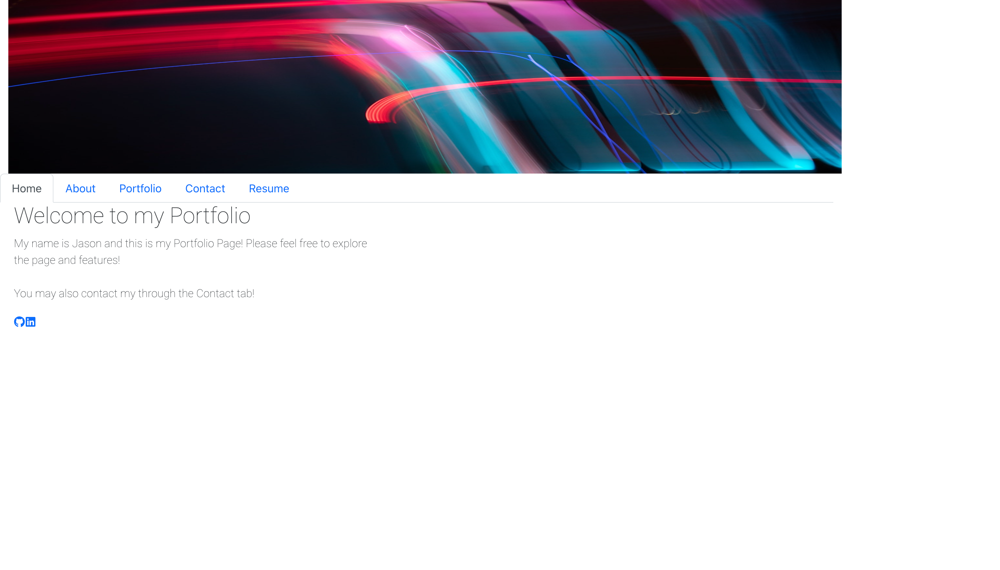

# React Portfolio Module Challenge 20

## Table of Contents
[Description](#description)
[React.js](#reactjs)
[Styling](#styling)
[Screenshot](#screenshot)
[Link](#link)
[GitHub](#github)

## Description
The purpose of this project was to build a personal portfolio pages using React.js to display a portfolio of projects that were completed.  This project used a combination of CSS and Bootstrap for styling of the webpage, in addition to cards created to display a description of the project and link to the deployed webpage for the project.

## React.js
React was used to created different components for the Header, Navigation, Footer and Portfolio.  Additionally, components were created for each page (Home, About, Contact and Resume) and a component was also created for the Card used on the Portfolio page.

## Styling
Styling on the web app used a combination of Bootstrap and CSS styling for each component.

## Screenshot

## Link 

The deployed app is [here](https://j-faust-github.io/react-portfolio-page)

## Github

The github page is located [here](https://github.com/j-faust/react-portfolio-page)